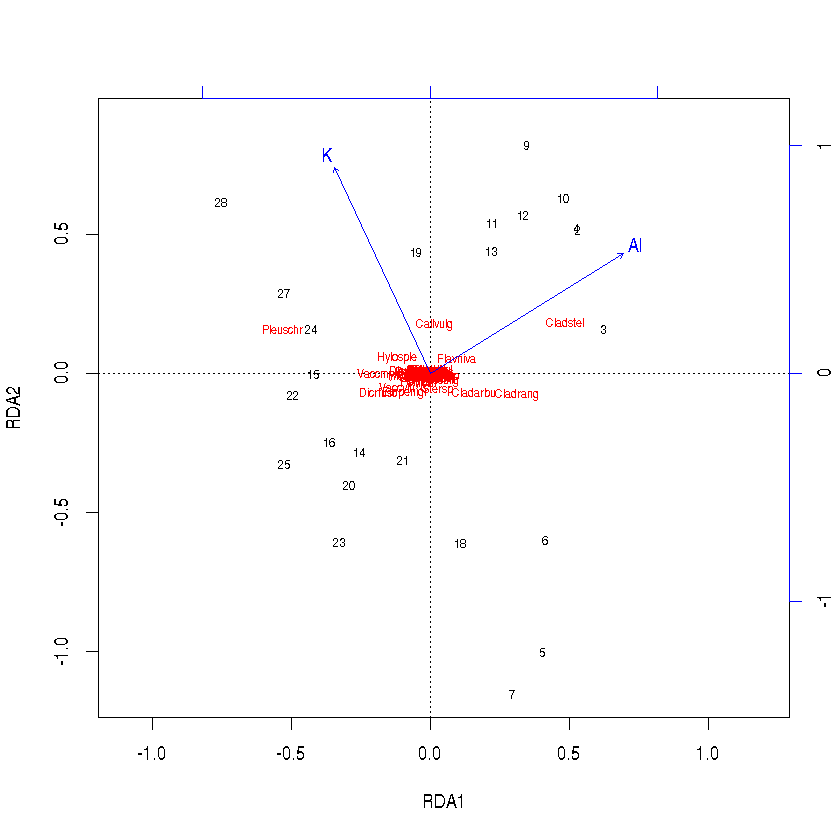
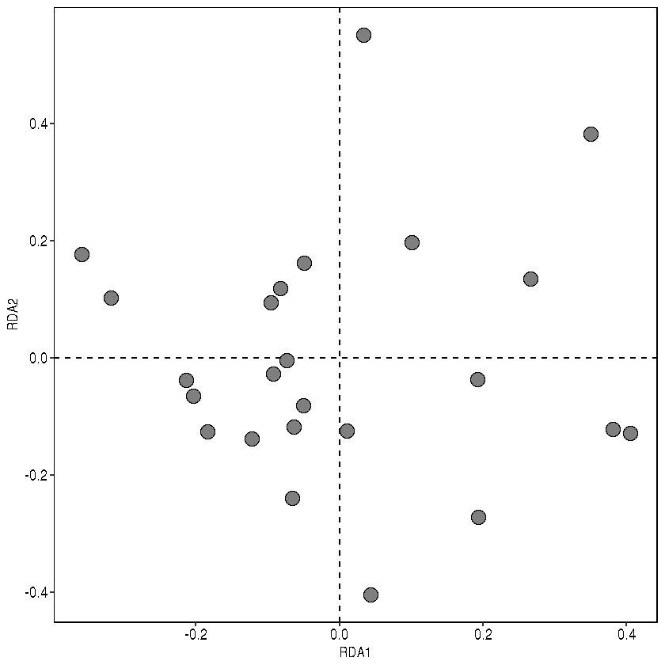
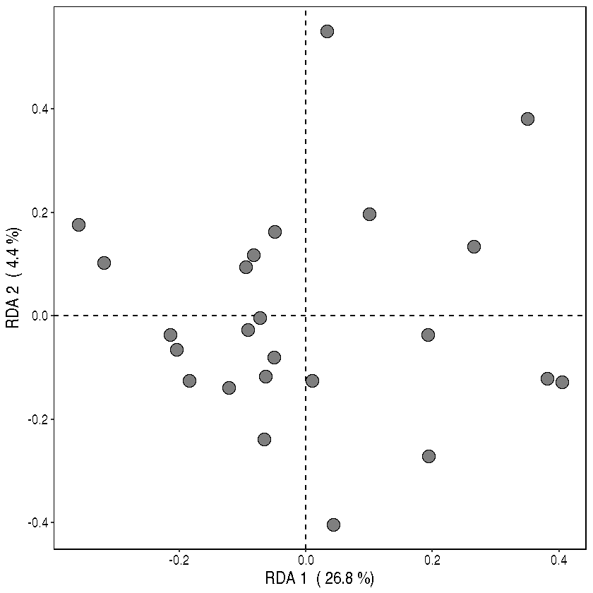
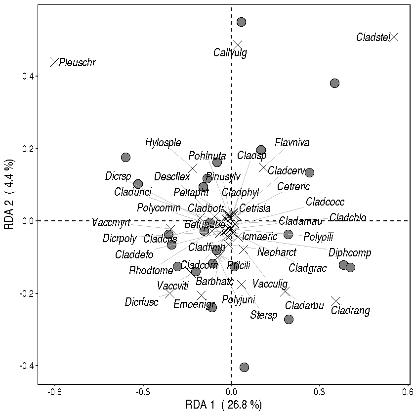
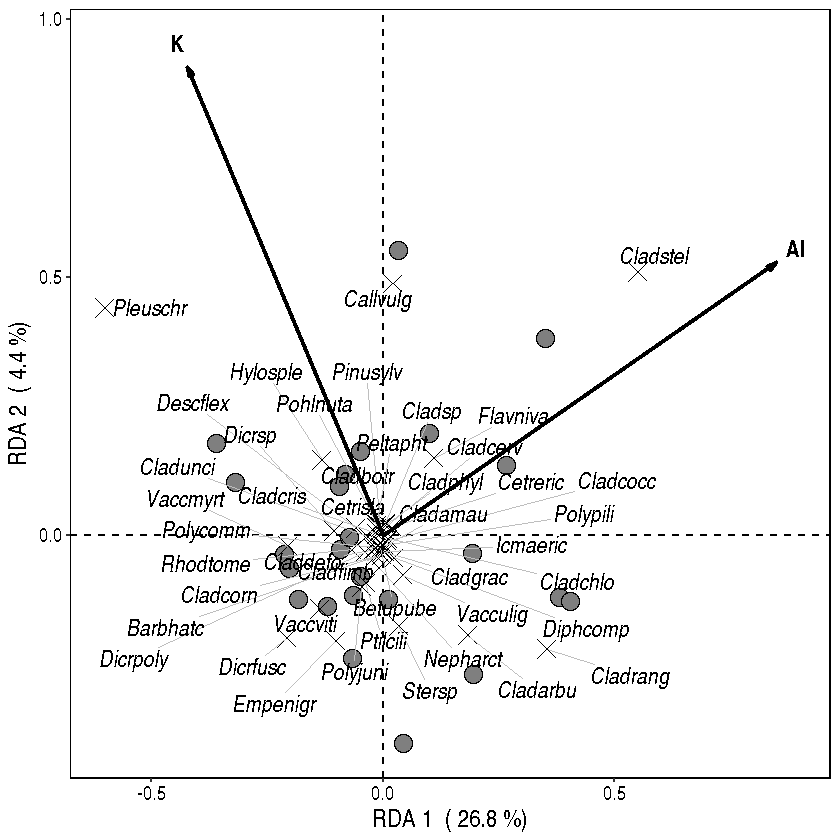
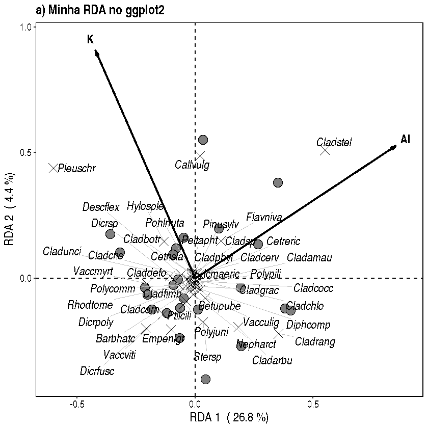

```R
# Enconding: ISO-8859-1
# rm(list = ls())

# Este um script para plotar ordenações (biplots ou triplots) usando os pacotes
# ggplot2, ggrepel e grid. O objeto da ordenação será gerado pelo pacote vegan.
# O script funcionará tanto para CCAs quanto para RDAs.
#
# O Gavin Simpson, um dos desenvolvedores do vegan, está trabalhando em um pacote
# exclusivo para as ordenações: https://github.com/gavinsimpson/ggvegan

# Este script teve como base a seguinte página: http://renatabrandt.github.io/EBC2015/PCA.html

# Problemas com a transparência do ggplot2 no jupyter notebook

install.packages("packfor", repos = "http://R-Forge.R-project.org")

ipak <- function(pkg){
    new.pkg <- pkg[!(pkg %in% installed.packages()[, "Package"])]
    if (length(new.pkg))
        install.packages(new.pkg, dependencies = TRUE)
    sapply(pkg, require, character.only = TRUE)
}
ipak(packages <- c("vegan", "ggplot2", "ggrepel", "grid", "packfor"))
```

    Installing package into ‘/home/kguidonimartins/R/x86_64-pc-linux-gnu-library/3.3’
    (as ‘lib’ is unspecified)
    Warning message:
    “package ‘packfor’ is not available (for R version 3.3.1)”Loading required package: vegan
    Loading required package: permute
    Warning message:
    “package ‘permute’ was built under R version 3.3.2”Loading required package: lattice
    This is vegan 2.4-1
    Loading required package: ggplot2
    Loading required package: ggrepel
    Loading required package: grid
    Loading required package: packfor
    packfor: R Package for Forward Selection (Canoco Manual p.49)
    version0.0-8


<dl class=dl-horizontal>
	<dt>vegan</dt>
		<dd>TRUE</dd>
	<dt>ggplot2</dt>
		<dd>TRUE</dd>
	<dt>ggrepel</dt>
		<dd>TRUE</dd>
	<dt>grid</dt>
		<dd>TRUE</dd>
	<dt>packfor</dt>
		<dd>TRUE</dd>
</dl>


```R
# dados de teste
data("varespec")
data("varechem")

# entrada
Y <- decostand(varespec, "hellinger")
X <- decostand(varechem, "standardize")

# rda com seleção
rda1 <- rda(Y ~ ., X) # modelo saturado
R2a.all <- RsquareAdj(rda1)$adj.r.squared
env.sel <- forward.sel(Y, X, adjR2thresh = R2a.all)
env.sign <-  sort(env.sel$order)
env.red <- X[, c(env.sign)]
rda2 <- rda(Y, env.red)

# Plot para uma rápida visualização
plot(rda2, type = "t")
```

    Testing variable 1
    Testing variable 2
    Procedure stopped (adjR2thresh criteria) adjR2cum = 0.246740 with 2 variables (superior to 0.232172)





```R
# Atribua o objeto da ordenação a cca.results
# A partir daqui, o script seguirá um esqueleto baseado no objeto cca.results
cca.results <- rda2

# Definindo objetos-padrão para o plot
cca.summary <- summary(cca.results)
(imp.axis.1 <- cca.summary$cont$importance[2,1]) # explicação do eixo 1
(imp.axis.2 <- cca.summary$cont$importance[2,2]) # explicação do eixo 2
(rowScores <- as.data.frame(cca.results$CCA$u))  # scores das parcelas
(colScores <- as.data.frame(cca.results$CCA$v))  # scores das espécies 
(bi.var <- as.data.frame(cca.results$CCA$biplot)) # scores das variáveis ambientais

# Para salvar a figura em alta resolução.
# Sempre adeque a resolução à altura e à largura da figura.
# tiff(filename="figura.tiff", res=600, height=600/72*600, width=600/72*600, compression= "lzw")
```


0.2682


0.04404


<table>
<thead><tr><th></th><th scope=col>RDA1</th><th scope=col>RDA2</th></tr></thead>
<tbody>
	<tr><th scope=row>18</th><td>-0.12164706 </td><td>-0.138454672</td></tr>
	<tr><th scope=row>15</th><td>-0.09207393 </td><td>-0.027437043</td></tr>
	<tr><th scope=row>24</th><td>-0.08244642 </td><td> 0.118276432</td></tr>
	<tr><th scope=row>27</th><td>-0.31866227 </td><td> 0.102483205</td></tr>
	<tr><th scope=row>23</th><td>-0.21422732 </td><td>-0.037220586</td></tr>
	<tr><th scope=row>19</th><td>-0.07309611 </td><td>-0.004037112</td></tr>
	<tr><th scope=row>22</th><td>-0.20395125 </td><td>-0.065071999</td></tr>
	<tr><th scope=row>16</th><td>-0.06397259 </td><td>-0.117585651</td></tr>
	<tr><th scope=row>28</th><td>-0.35971648 </td><td> 0.176654911</td></tr>
	<tr><th scope=row>13</th><td> 0.03348894 </td><td> 0.550957391</td></tr>
	<tr><th scope=row>14</th><td>-0.05050650 </td><td>-0.080789145</td></tr>
	<tr><th scope=row>20</th><td>-0.09538928 </td><td> 0.094852741</td></tr>
	<tr><th scope=row>25</th><td>-0.18366706 </td><td>-0.125512612</td></tr>
	<tr><th scope=row>7</th><td> 0.38110448 </td><td>-0.121112621</td></tr>
	<tr><th scope=row>5</th><td> 0.04292005 </td><td>-0.403398131</td></tr>
	<tr><th scope=row>6</th><td> 0.19365974 </td><td>-0.270992978</td></tr>
	<tr><th scope=row>3</th><td> 0.40474166 </td><td>-0.127829076</td></tr>
	<tr><th scope=row>4</th><td> 0.35009055 </td><td> 0.381765731</td></tr>
	<tr><th scope=row>2</th><td> 0.26569681 </td><td> 0.134470667</td></tr>
	<tr><th scope=row>9</th><td> 0.19238782 </td><td>-0.036333011</td></tr>
	<tr><th scope=row>12</th><td> 0.01002820 </td><td>-0.124939499</td></tr>
	<tr><th scope=row>10</th><td>-0.04929891 </td><td> 0.162478799</td></tr>
	<tr><th scope=row>11</th><td> 0.10049707 </td><td> 0.197219972</td></tr>
	<tr><th scope=row>21</th><td>-0.06596012 </td><td>-0.238445714</td></tr>
</tbody>
</table>


<table>
<thead><tr><th></th><th scope=col>RDA1</th><th scope=col>RDA2</th></tr></thead>
<tbody>
	<tr><th scope=row>Callvulg</th><td> 0.0213821439</td><td> 0.487565100 </td></tr>
	<tr><th scope=row>Empenigr</th><td>-0.1028800932</td><td>-0.205699722 </td></tr>
	<tr><th scope=row>Rhodtome</th><td>-0.0673825328</td><td>-0.028007275 </td></tr>
	<tr><th scope=row>Vaccmyrt</th><td>-0.2057010800</td><td>-0.021884289 </td></tr>
	<tr><th scope=row>Vaccviti</th><td>-0.1369371380</td><td>-0.143735767 </td></tr>
	<tr><th scope=row>Pinusylv</th><td>-0.0054819703</td><td> 0.015666269 </td></tr>
	<tr><th scope=row>Descflex</th><td>-0.0589698872</td><td> 0.013558573 </td></tr>
	<tr><th scope=row>Betupube</th><td>-0.0058293172</td><td>-0.024154966 </td></tr>
	<tr><th scope=row>Vacculig</th><td> 0.0413330534</td><td>-0.078209765 </td></tr>
	<tr><th scope=row>Diphcomp</th><td> 0.0223808702</td><td>-0.044046188 </td></tr>
	<tr><th scope=row>Dicrsp</th><td>-0.1066372036</td><td> 0.008759356 </td></tr>
	<tr><th scope=row>Dicrfusc</th><td>-0.2092436681</td><td>-0.200159292 </td></tr>
	<tr><th scope=row>Dicrpoly</th><td>-0.0211108327</td><td>-0.026478254 </td></tr>
	<tr><th scope=row>Hylosple</th><td>-0.1320600643</td><td> 0.145808513 </td></tr>
	<tr><th scope=row>Pleuschr</th><td>-0.6006629905</td><td> 0.439280900 </td></tr>
	<tr><th scope=row>Polypili</th><td>-0.0005957191</td><td>-0.020928699 </td></tr>
	<tr><th scope=row>Polyjuni</th><td>-0.0471208513</td><td>-0.100722915 </td></tr>
	<tr><th scope=row>Polycomm</th><td>-0.0164163583</td><td>-0.024344171 </td></tr>
	<tr><th scope=row>Pohlnuta</th><td>-0.0127706828</td><td> 0.020073012 </td></tr>
	<tr><th scope=row>Ptilcili</th><td>-0.0378422309</td><td>-0.093164435 </td></tr>
	<tr><th scope=row>Barbhatc</th><td>-0.0153140042</td><td>-0.041235613 </td></tr>
	<tr><th scope=row>Cladarbu</th><td> 0.1821199819</td><td>-0.193883848 </td></tr>
	<tr><th scope=row>Cladrang</th><td> 0.3543591769</td><td>-0.220865518 </td></tr>
	<tr><th scope=row>Cladstel</th><td> 0.5506037292</td><td> 0.509298512 </td></tr>
	<tr><th scope=row>Cladunci</th><td>-0.0349403083</td><td>-0.002221616 </td></tr>
	<tr><th scope=row>Cladcocc</th><td> 0.0076922685</td><td>-0.011888027 </td></tr>
	<tr><th scope=row>Cladcorn</th><td>-0.0152121103</td><td>-0.040729356 </td></tr>
	<tr><th scope=row>Cladgrac</th><td>-0.0016897124</td><td>-0.031307493 </td></tr>
	<tr><th scope=row>Cladfimb</th><td>-0.0038474779</td><td>-0.039520267 </td></tr>
	<tr><th scope=row>Cladcris</th><td>-0.0143379259</td><td> 0.002346151 </td></tr>
	<tr><th scope=row>Cladchlo</th><td> 0.0107469341</td><td>-0.007216347 </td></tr>
	<tr><th scope=row>Cladbotr</th><td>-0.0135743085</td><td> 0.014145076 </td></tr>
	<tr><th scope=row>Cladamau</th><td> 0.0026057445</td><td>-0.022158674 </td></tr>
	<tr><th scope=row>Cladsp</th><td> 0.0048870773</td><td> 0.023086112 </td></tr>
	<tr><th scope=row>Cetreric</th><td> 0.0177665733</td><td> 0.014674723 </td></tr>
	<tr><th scope=row>Cetrisla</th><td> 0.0002285120</td><td> 0.010089368 </td></tr>
	<tr><th scope=row>Flavniva</th><td> 0.1095236596</td><td> 0.148943935 </td></tr>
	<tr><th scope=row>Nepharct</th><td>-0.0089063875</td><td>-0.064297056 </td></tr>
	<tr><th scope=row>Stersp</th><td> 0.0335615997</td><td>-0.175275819 </td></tr>
	<tr><th scope=row>Peltapht</th><td>-0.0147309544</td><td> 0.019211462 </td></tr>
	<tr><th scope=row>Icmaeric</th><td> 0.0035316248</td><td>-0.032476113 </td></tr>
	<tr><th scope=row>Cladcerv</th><td> 0.0066924224</td><td> 0.015749643 </td></tr>
	<tr><th scope=row>Claddefo</th><td>-0.0405470078</td><td>-0.032788412 </td></tr>
	<tr><th scope=row>Cladphyl</th><td> 0.0066272660</td><td> 0.021368369 </td></tr>
</tbody>
</table>


<table>
<thead><tr><th></th><th scope=col>RDA1</th><th scope=col>RDA2</th></tr></thead>
<tbody>
	<tr><th scope=row>K</th><td>-0.4227100</td><td>0.9062650 </td></tr>
	<tr><th scope=row>Al</th><td> 0.8494685</td><td>0.5276393 </td></tr>
</tbody>
</table>


```R
##################################
# PLOTANDO AS UNIDADES AMOSTRAIS #
##################################

ggrda1 <- ggplot() +
  # geom_point(data=rowScores, aes(x=RDA1, y=RDA2),
  #            size=4,
  #            fill = "white",
  #            shape=22) +
  geom_vline(xintercept = 0, alpha=1, linetype = "dashed") +
  geom_hline(yintercept = 0, alpha=1, linetype = "dashed") +
  geom_point(data = rowScores, aes(x = RDA1, y = RDA2),
             size = 5,
             color = "black", fill="grey50", shape=21) +
  theme(panel.background = element_rect(fill = "white", colour = NA),
        panel.grid.minor = element_line(colour = NULL),
        panel.grid.major = element_line(colour = NULL),
        plot.background = element_rect(fill = "white", colour = NA),
        panel.border = element_rect(fill = NA, colour = "black"),
        axis.text.x = element_text(color ="black", size = 12, angle = 0),
        axis.text.y = element_text(color ="black", size = 12, angle = 0))

# http://www.sthda.com/english/wiki/ggplot2-axis-ticks-a-guide-to-customize-tick-marks-and-labels
# http://www.sthda.com/english/wiki/ggplot2-line-types-how-to-change-line-types-of-a-graph-in-r-software

# Visualizar
ggrda1
```





```R
########################################
# DEFININDO EIXOS E LEGENDAS DOS EIXOS #
########################################

ggrda2 <- ggrda1 +
  xlab(paste("RDA 1 ", "(", round(imp.axis.1*100, digits = 1), "%)")) +
  theme(axis.title.x=element_text(angle = 0, size = 15)) + #, face = "bold"
  ylab(paste("RDA 2 ", "(", round(imp.axis.2*100, digits = 1), "%)")) +
  theme(axis.title.y=element_text(angle = 90, size = 15)) #, face = "bold"

# Visualizar
ggrda2
```





```R
########################
# PLOTANDO AS ESPÉCIES #
########################

# Geralmente as espécies estão sobrepostas. Daí tem uns truques.
# Se as espécies NÂO estiverem sobrepostas, só rode o comando abaixo.
# Se estiverem sobrepostas, bloqueie o comando geom_text e
#libere o geom_point e geom_text_repel.
# Isso vai plotar os pontos das espécies e espalhar os nomes.


ggrda3 <- ggrda2 +
# SE AS ESPÉCIES ESTIVEREM SOBREPOSTAS, BLOQUEIE O COMANDO ABAIXO:
    # geom_text(data=colScores, aes(RDA1, RDA2),
  #           size=4,
  #           label = rownames(colScores),
  #           fontface="italic")
  
# SE AS ESPÉCIES NÃO ESTIVEREM SOBREPOSTAS, BLOQUEIE O COMANDO ABAIXO
  geom_point(data = colScores, aes(RDA1, RDA2),
             size = 5, shape = 4)+
  geom_text_repel(aes(x = colScores$RDA1, y = colScores$RDA2,
                      label = rownames(colScores)),
                  size = 5,
                  fontface ="italic",
                  segment.color = "grey",
                  alpha = 1,
                  segment.size = 0.1,
                  box.padding = unit(0.3, 'lines'))#

# Visualizar
ggrda3
```





```R
####################################
# PLOTANDO AS VARIÁVEIS AMBIENTAIS #
####################################

ggrda4 <- ggrda3 +
  geom_segment(data = bi.var, aes(x = 0, y = 0, xend = RDA1, yend = RDA2),
               size = 1,
               arrow = arrow(length = unit(0.2, "cm"),
                             type = "closed", angle = 15),
               color = "black",
               alpha = 1) +
  geom_text(data = bi.var, aes(RDA1*1.05, RDA2*1.05,
                               label = rownames(bi.var)),
            color = "black",
            size = 5,
            fontface = "bold")
#geom_text_repel(aes(x = colScores$PC1, y = colScores$PC2, label = rownames(colScores)))

# Visualizar
ggrda4
```





```R
ggrda5 <- ggrda4 + ggtitle("a) Minha RDA no ggplot2") +
  theme(plot.title = element_text(lineheight =.8, face = "bold", size = 16))

ggrda5

# para fechar a figura
# dev.off() 
```




